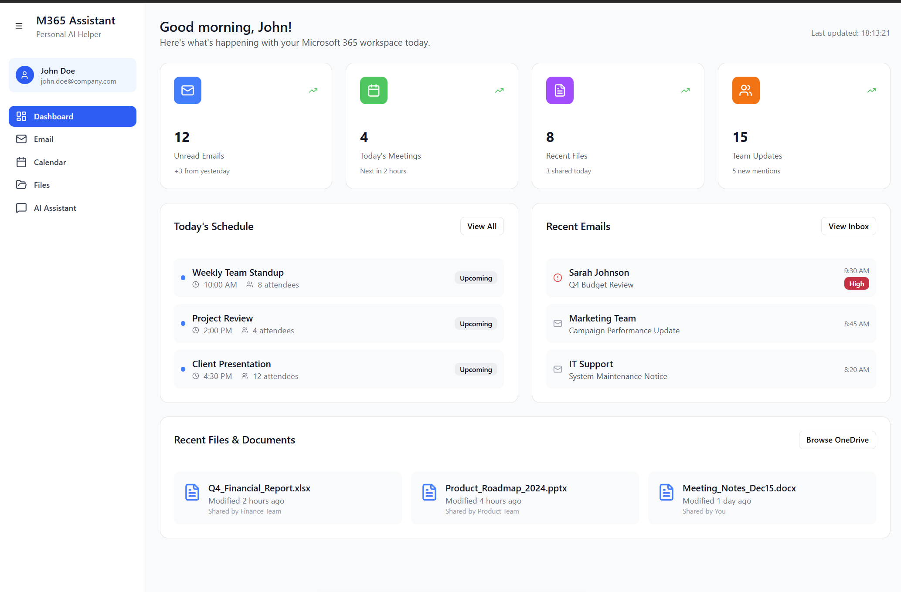
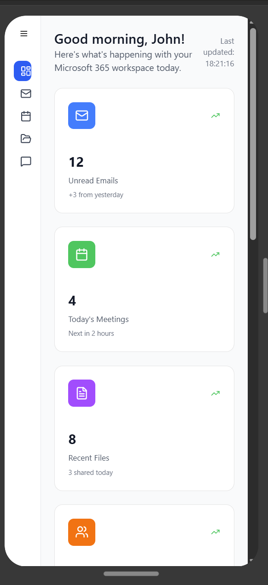

# Project overview

An Azure static web app, to provide a single view for an executive or sole-trader to be able to easily access important information for their day and days ahead.

# Project objectives

	- React frontend for a personal assistant that integrates with Microsoft 365. 
	- Can see latest emails
	- Can see calendar
	- Access to important, meeting-related documents
	- Configurable visual reports
	- Copilot agents can triage email and meetings
		- No back-to-back meetings
	- Task management

**This will require connecting to external APIs to fetch data from Microsoft 365 services like Outlook, Calendar, OneDrive, and Teams** 

**The frontend will feature a dashboard with widgets for emails, calendar events, recent files, and an AI chat interface**

# Microsoft 365 Personal Assistant Frontend

## Version 1
	- React frontend for a Microsoft 365 personal assistant with mock data
	- includes a responsive dashboard
		- email management, calendar view, file browser, and an AI chat assistant that simulates interactions with M365 data.

## Key features implemented:
	-  Dashboard - Overview widgets showing unread emails, meetings, files, and team updates
	- Email View - Full inbox interface with email list, content preview, and actions
	- Calendar - Monthly calendar view with event details and scheduling interface 
	- Files - OneDrive-style file browser with grid/list views and file management
	- AI Assistant - Chat interface that responds to queries about M365 data
	- Responsive Design - Collapsible sidebar and mobile-friendly layout

## Potential next steps:
	- Connect to real Microsoft Graph APIs for live data integration
	- Add user authentication with Microsoft 365 accounts
	- Implement real-time notifications and updates

# Design requirements

## Desktop 

Possible design

## Mobile

Possible design

# Tech stack

	- React 
	- Node.js
	- HTML
	- CSS
	- Microsoft 365
	- Microsoft Copilot
	- Power Automate
	
# Integrations

	- Microsoft Graph
	- SharePoint
	- Copilot studio

